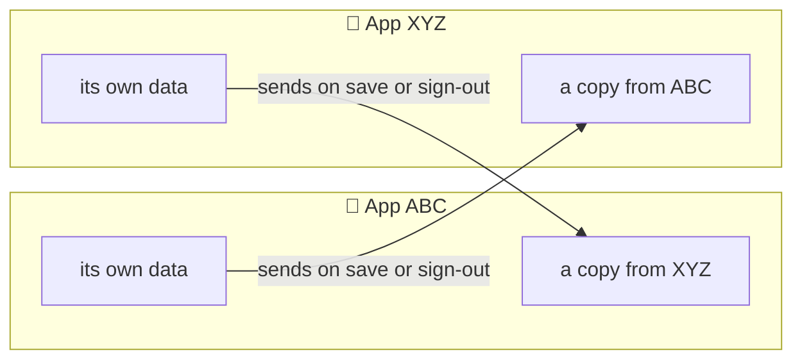
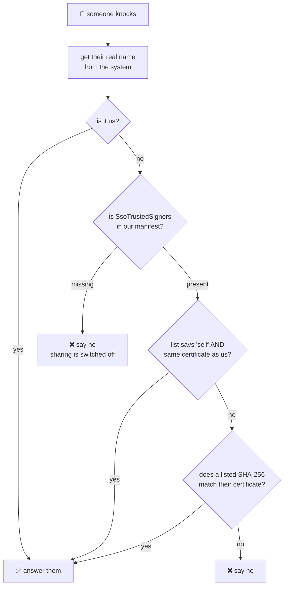
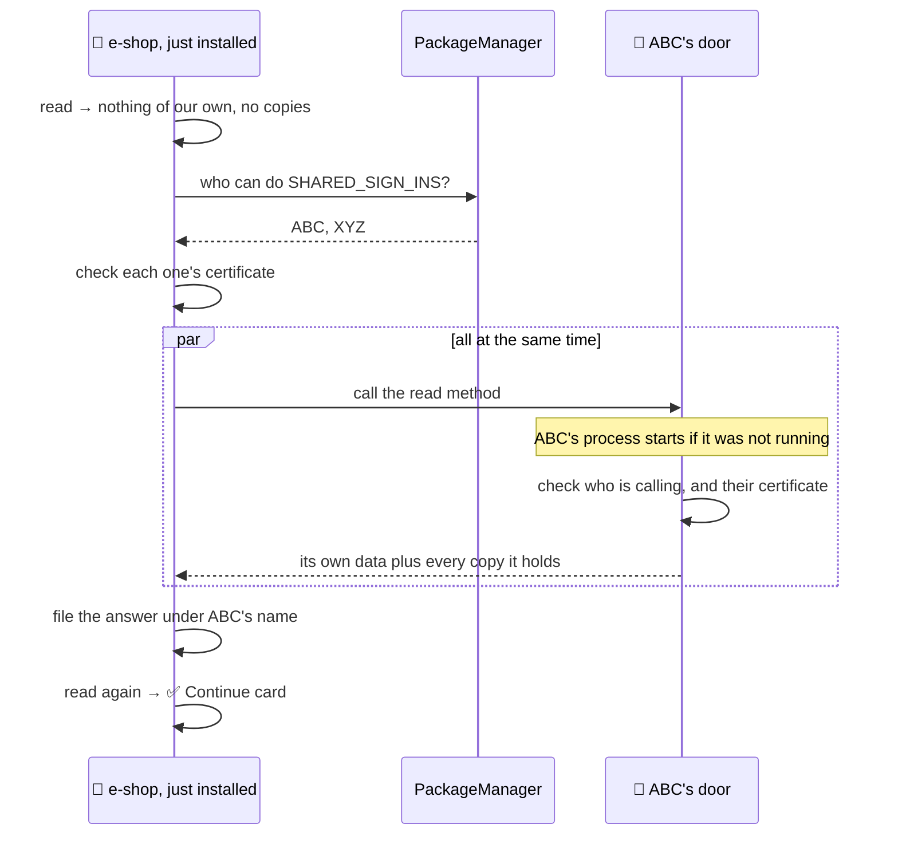
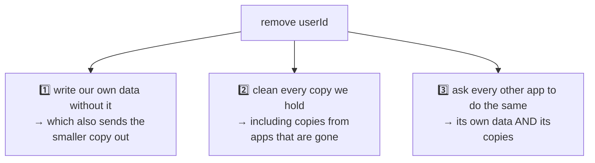
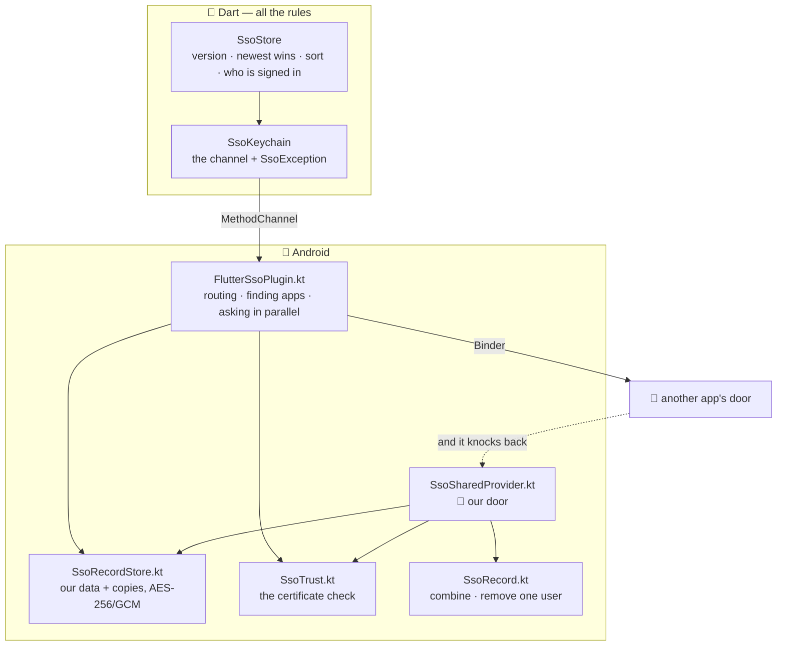

# 🤖 How flutter_sso works on Android

**There is no shared box on Android. So each app keeps its own copy, and answers the door
when another app knocks.**

This file explains what happens inside. For setup and the API, see
[`README.md`](README.md). For the iOS side, see [`IOS_MECHANISM.md`](IOS_MECHANISM.md).

Every part below is written the same way: **the problem first**, then **what we do**, then
**which Android concept we used**.

---

## 📑 What is in this file

- [The big picture](#-the-big-picture)
- [Concepts we use from Android](#-concepts-we-use-from-android)
- [Problem 1: there is no shared box, and there never will be](#-problem-1-there-is-no-shared-box-and-there-never-will-be)
- [Problem 2: so where do we keep things?](#-problem-2-so-where-do-we-keep-things)
- [Problem 3: asking at start-up would be slow](#-problem-3-asking-at-start-up-would-be-slow)
- [Problem 4: how does another app reach us at all?](#-problem-4-how-does-another-app-reach-us-at-all)
- [Problem 5: who is knocking?](#-problem-5-who-is-knocking)
- [Problem 6: should we trust them?](#-problem-6-should-we-trust-them)
- [Problem 7: how do we find the other apps?](#-problem-7-how-do-we-find-the-other-apps)
- [Problem 8: a brand new app has nothing](#-problem-8-a-brand-new-app-has-nothing)
- [Problem 9: an app that only tapped Continue](#-problem-9-an-app-that-only-tapped-continue)
- [Problem 10: two apps hold the same account](#-problem-10-two-apps-hold-the-same-account)
- [Problem 11: deleting one copy is not deleting](#-problem-11-deleting-one-copy-is-not-deleting)
- [Problem 12: the data must be safe on disk](#-problem-12-the-data-must-be-safe-on-disk)
- [Problem 13: a slow app next door](#-problem-13-a-slow-app-next-door)
- [Problem 14: an old app must not break a new one](#-problem-14-an-old-app-must-not-break-a-new-one)
- [What happens when an app is deleted](#-what-happens-when-an-app-is-deleted)
- [Other ways we could have done this](#-other-ways-we-could-have-done-this-and-why-we-did-not)
- [Things that are still rough](#-things-that-are-still-rough)
- [The whole thing on one page](#-the-whole-thing-on-one-page)

---

## 🎯 The big picture

Each app keeps its **own** locked-up copy of the saved sign-ins. When an app **writes**, it
hands a copy to every app it trusts. When an app **reads**, it only looks at its own disk.



**A read never talks to another app.** No waiting, nobody woken up, the same speed with 2
apps or 20. That is the main decision in this design, and most of the rest follows from it.

---

## 🧠 Concepts we use from Android

| Android concept | In plain words | What we use it for |
| --- | --- | --- |
| **App sandbox / Linux uid** | Every app gets its own user account on the phone | The reason there is **no** shared store |
| **`SharedPreferences`** | A simple private key-and-value file | Where each app keeps its data |
| **Android Keystore** | A key store built into the phone. Keys cannot be copied out | Makes the key that encrypts the data |
| **`Cipher` with AES-256/GCM** | Strong encryption that also spots tampering | Locks the data before it hits the disk |
| **`ContentProvider`** | A part of your app that other apps are allowed to call | **The door** |
| **Binder / `ContentResolver.call`** | Android's way for two apps to talk | Carries the question and the answer |
| **`callingPackage`** | The real name of the app calling you, checked by the system | So nobody can pretend to be your app |
| **`PackageManager.checkSignatures`** | Do these two apps have the same certificate? | What `self` uses |
| **`hasSigningCertificate`** | Does this app have this exact certificate? | What a SHA-256 list uses |
| **Manifest `meta-data`** | A named value inside the app's manifest | Holds `SsoTrustedSigners` |
| **`manifestPlaceholders`** | Gradle filling in a manifest value at build time | The trusted list comes from `key.properties`, not the repo |
| **`<queries>`** (package visibility) | Android 11+ hides other apps unless you say what you are looking for | Without it, your other app looks uninstalled |
| **`intent-filter`** + **`queryIntentContentProviders`** | Find apps by what they can **do**, not by their name | So a new app needs no changes in the old ones |
| **`ExecutorService`** | Runs work on background threads | Keeps all this off the screen thread |
| **`MethodChannel`** | Flutter's bridge from Dart to native code | Every call goes through one |

---

## 🚧 Problem 1: there is no shared box, and there never will be

**❓ The problem**

On iOS, Apple gives two of your apps one shared locked box. **Android has nothing like it.**
Not with the same signing key. Not with any setting. Not with any plugin.

Two separate reasons, and **both** would have to go away:

1. **Your app's files belong to your app's user account.** Android gives every installed app
   its own Linux user id and its own folder. App B cannot open App A's files. Full stop.
2. **The encryption key belongs to that user account too.** Even if App B somehow got the
   raw bytes, it could not unlock them. The AES key sits in the Android Keystore under App
   A's user id, and it cannot be copied out.

**✅ What we do**

We accept it. App B **cannot open App A's drawer**, so instead **App B knocks on App A's
door and asks.**

That single sentence is why the Android code looks nothing like the iOS code.

**🧩 Concept used:** App sandbox / Linux uid, Android Keystore.

---

## 💾 Problem 2: so where do we keep things?

**❓ The problem**

If every app has its own data, and copies get passed around, how do we stop one app from
writing over another app's data by mistake?

**✅ What we do**

Each app has one private `SharedPreferences` file, and inside it we keep **two kinds of
thing**:

```
📱 ABC  (user id 10234)                    📱 XYZ  (user id 10235)
└─ private file "flutter_sso"            └─ private file "flutter_sso"
   ├─ sso_credentials              ← ours     ├─ sso_credentials              ← ours
   ├─ sso_credentials.from.…xyz    ← copy     ├─ sso_credentials.from.…abc    ← copy
   └─ sso_credentials.from.…eshop  ← copy     └─ sso_credentials.from.…eshop  ← copy

   🔐 all values encrypted with AES-256/GCM, key from the Android Keystore
```

| Entry | Its name | What it is | Who may write it |
| --- | --- | --- | --- |
| **Ours** | `sso_credentials` | What **this app itself** signed in with. The only thing our own writes may change. | this app only |
| **A copy** | `sso_credentials.from.<app>` | Another app's whole data, exactly as it last sent it. One slot per app. | only that app, through the door |

The trick is in the **name of the copy**. A copy is filed under the name of the app that
sent it — and that name comes from the **system's own check of who called**, never from
anything the caller typed in the request.

So another app can overwrite **what it told us last time** and **nothing else**. Not another
app's copy. Not our own data.

**🧩 Concept used:** `SharedPreferences`, `callingPackage`.

---

## ⚡ Problem 3: asking at start-up would be slow

**❓ The problem**

The obvious design is: when my app starts, ask all my other apps what they have.

That is a bad idea. Reading happens **while your app is starting**, on the screen the user is
watching. And asking another app **can start that app's whole process**. With five apps, your
launch screen waits for up to four cold starts before it can show a card. With twenty, it is
hopeless.

**✅ What we do**

We turn it around. **We give, instead of asking.**

```
save() ──▶ lock and store our own data
       ──▶ then hand a copy to every app we trust     ← the only talking

read() ──▶ our own data + every copy we already hold
       ──▶ all local. no talking. nobody woken up.
```

Writing happens once, when the user signs in or out — a moment when they are **already**
waiting for your login API. A few more milliseconds there are invisible. Reading happens
many times, on the launch screen, so we made reading cost nothing.

The sending is done in **exactly one place**, so no caller can forget it:

```dart
Future<void> _writeOwn(List<SsoCredential> credentials) async {
  final record = jsonEncode({'v': schemaVersion, 'credentials': …});
  await _keychain.write(record);
  await _keychain.pushToPeers(record);
}
```

And if a copy does not arrive? That app has **one stale start-up**. It catches up the next
time anybody writes, and its own sign-in screen works fine in the meantime.

> 🏛 **There is no main app and no helper app.** Every app gives, and every app answers. So
> no single app being deleted takes the feature away from the others.

**🧩 Concept used:** `ContentResolver.call`, `ExecutorService`.

---

## 🚪 Problem 4: how does another app reach us at all?

**❓ The problem**

Apps are kept apart. So how can one app call into another at all — and how do we make sure
there is only **one** way in, that we control?

**✅ What we do**

Android has a built-in part for exactly this: a **`ContentProvider`**. It is a piece of your
app that other apps are allowed to call. We ship one, and you never have to declare it — the
package's own manifest adds it to your app:

```xml
<provider
    android:name="com.flutter_sso.SsoSharedProvider"
    android:authorities="${applicationId}.flutter_sso"
    android:exported="true">
    <intent-filter>
        <action android:name="flutter_sso.action.SHARED_SIGN_INS" />
    </intent-filter>
</provider>
```

`${applicationId}` becomes your own app id, so each app owns its own address and two never
clash.

The talking itself is `ContentResolver.call(...)`, which goes through **Binder** — Android's
built-in way for two apps to pass a small bundle of values. Not files. Not broadcasts. Three
things about it matter:

- ⚡ **It starts the other app's process** if it is not running. The other app does not have
  to be open.
- 🪪 **We can find out who called, for real** (next problem).
- 🎯 **There are only four things a caller may ask.**

| Ask | What the answering app does |
| --- | --- |
| `read` | Gives back everything it knows — its own data **and** every copy it holds |
| `write` | Files the caller's data under the caller's name. Max 256 KB |
| `remove` | Drops one `userId` from its own data **and** from every copy |
| `clear` | Deletes its own data **and** every copy |

A `ContentProvider` normally also offers a table-like way in — rows you can query, insert and
delete. We switched all of that off:

```kotlin
// The record is one document behind one guarded call, not rows: a cursor surface would
// be a second, unchecked way in.
override fun query(…): Cursor? = null
override fun insert(…): Uri? = null
override fun delete(…): Int = 0
override fun update(…): Int = 0
```

**One door, one lock.** Leaving the table side open would have been a second way in that
nothing checks.

**🧩 Concept used:** `ContentProvider`, `intent-filter`, Binder, `ContentResolver.call`.

---

## 🪪 Problem 5: who is knocking?

**❓ The problem**

Anything on the phone can knock on an exported door. If we simply believed whatever name the
caller gave us, any app could say "hi, I am your other app" and walk off with the sign-ins.

**✅ What we do**

We ask **the system**, not the caller:

```kotlin
// The platform has already checked this name against the calling uid, so it is the
// caller's real identity and not something it asked to be called. Deliberately not
// Binder.getCallingUid(): that one answers with OUR OWN uid when it is read anywhere
// but the binder thread, which would turn this gate into "am I myself?" — the one way
// this design could fail open. And never getCallingPackageUnchecked().
val caller = callingPackage
if (caller == null || !SsoTrust.isTrusted(context, caller)) {
  SsoLog.warn("provider: refused ${caller ?: "uid ${Binder.getCallingUid()}"}")
  return null
}
```

`callingPackage` is worked out by Android from the real caller. It **cannot be faked**.

Three traps are avoided in those four lines, and **the middle one is the dangerous one**:

- ❌ `Binder.getCallingUid()` looks like the right tool. But read it from a background thread
  — a worker, a coroutine, anywhere but the exact thread Binder called you on — and it hands
  back **your own** app's user id. Then the check reads "am I myself?", which is always true,
  and **the door opens for everybody**.
- ❌ `getCallingPackageUnchecked()` is the version with no checking. The name says it.
- ✅ `callingPackage` is the one that is checked for you.

**🧩 Concept used:** `callingPackage`, Binder identity.

---

## 🛡 Problem 6: should we trust them?

**❓ The problem**

We now know **who** is knocking. But knowing the name is not enough — a name proves nothing.
Any app can be called anything.

On iOS, Apple answers this for us: the box name has to start with your Team ID, and Apple
will not sign it for anyone else. **Android has no such thing.** So we have to do the check
ourselves.

**✅ What we do**

We check the caller's **app signing certificate**. That is the thing that proves an app is
really yours, and it cannot be faked without your private key. You say which certificates
you trust in your manifest, as `SsoTrustedSigners`.



Three things about this check are on purpose:

### 🔁 It runs in **both** directions

The door checks the caller before answering. **And** the caller checks the answerer before
believing a single word of the reply:

```kotlin
if (!SsoTrust.isTrusted(context, info.packageName)) {
  SsoLog.warn("peers: ${info.packageName} is not a trusted signer, ignoring it")
  return@mapNotNull null
}
```

**❓ Why the second check matters:** without it, any app could put up its own door with our
name on it and hand us a made-up account. We would show a Continue card for a sign-in a
stranger invented.

This is also why a fingerprint missing in **one** app breaks that pair **both** ways.

### 🚫 Anything we are unsure about is a **no**

```kotlin
/// Every failure is a refusal, never an "unknown". `hasSigningCertificate` returns false
/// — and `getPackagesForUid` null — when a package is merely invisible under Android 11
/// package-visibility rules, so treating a falsy answer as anything but "no" would open
/// the door precisely when the platform meant to close it.
```

On Android 11 and later, an app you are not allowed to see looks the same as an app that does
not exist. If we treated "I could not tell" as "probably fine", we would open the door in
exactly the moment Android was trying to close it.

### 🔄 Fingerprints keep working after a key change

For Android 9 and later we use `hasSigningCertificate`, which is the call Google's own docs
tell you to use. It knows about **key changes**: an app whose key Play has upgraded still
matches the fingerprint you wrote down years earlier.

Below Android 9 we read the current certificate instead — nothing is lost, because those
versions cannot change a signing key at all.

And a typo in your manifest means "this one does not match", never a crash:

```kotlin
/// Null rather than a throw: a typo in a manifest value must not crash an app on
/// launch, it must only mean "this signer does not match".
private fun String.hexToBytes(): ByteArray? {
  if (length != 64) return null
  …
}
```

**🧩 Concept used:** `PackageManager.checkSignatures`, `hasSigningCertificate`, manifest
`meta-data`, `manifestPlaceholders`.

---

## 🔭 Problem 7: how do we find the other apps?

**❓ The problem**

We could list your other apps' package names in the code. That would be the easy way — and
it would be a trap. Every time you add a **new** app, you would have to release **all** the
old apps just so they know the new name exists.

**✅ What we do**

We look for apps by **what they can do**, not by their name:

```kotlin
val providers = context.packageManager
  .queryIntentContentProviders(Intent(SsoSharedProvider.ACTION), 0)
```

Every app with this package declares that it can do `flutter_sso.action.SHARED_SIGN_INS`.
So we ask Android "who can do this?" and it tells us.

One more thing is needed. **Android 11 and later hides other apps from you** unless you say
what you are looking for. So the package's manifest also says:

```xml
<queries>
    <intent><action android:name="flutter_sso.action.SHARED_SIGN_INS" /></intent>
</queries>
```

Without that, your other app looks **exactly like an app that is not installed** — which is a
very confusing bug to chase.

> 💡 **This is why a new app usually needs no changes in the old apps.** The list of other
> apps is worked out **fresh, at the moment we call**, from whatever is installed right then.
> Nothing about any single app is baked into the code — no name, no count. The **only** thing
> ever baked in is a **certificate fingerprint**, and only if you use fingerprint lists
> instead of `self`. That is the one case where adding an app means releasing the old ones.

We ask all the doors **at the same time**, not one after another:

```kotlin
// At once, not one after another, because answering can mean starting the sibling app's
// process: in a family of ten apps, nine of those in a row is the difference between a
// splash screen and a complaint. In parallel the cost is the slowest sibling, not the
// sum of all of them.
val pool = Executors.newFixedThreadPool(minOf(doors.size, PARALLEL_PEERS))
```

An app that is missing, being updated, force-stopped, or simply says no is **not an error**.
It is one fewer card to show.

**🧩 Concept used:** `queryIntentContentProviders`, `<queries>`, `ExecutorService`.

---

## 🆕 Problem 8: a brand new app has nothing

**❓ The problem**

Giving copies away when you write covers almost everything. But it cannot cover one case:

**you install a new app *after* everyone has already signed in.**

Nobody has given that app anything, because nobody has written anything since it appeared. So
it has no data and no copies. It would show an email-and-password form while the app right
next to it holds the account.

**✅ What we do**

`read()` asks the others — but **only** when it found absolutely nothing:

```dart
if (everyone.isEmpty) {
  final pulled = await _keychain
      .pullPeers()
      .timeout(config.peerTimeout, onTimeout: () => 0);
  if (pulled > 0) { … }
}
```



Answers are filed as copies, so this is paid **once**. Every read after that is local again.

We log **both** numbers, because "no records" means two very different things:

```
[sso] peers: 2 trusted door(s), 1 record(s) pulled
```

| What you see | What it means |
| --- | --- |
| `0 trusted door(s)` | Not installed, hidden by package visibility, or **not signed by a certificate you trust**. Signing in over there will **never** show up here. Go fix your setup. |
| `2 door(s), 0 record(s)` | Your other apps really have nothing saved yet. That is the normal state before anybody signs in. |

**🧩 Concept used:** `ContentResolver.call`, `Future.timeout`.

---

## 🎁 Problem 9: an app that only tapped Continue

**❓ The problem**

This one is subtle, and it is a real bug we hit.

Say XYZ signs in and hands ABC a copy. The user opens ABC and taps **Continue** — so ABC has
a live session. But ABC's **own** data may still be empty: the account it is showing came
from XYZ's copy.

Now delete XYZ and install it again.

XYZ asks ABC "what have you got?" — and if the door answered with **only its own data**, ABC
would truthfully say **"nothing"**, while showing that very account on its own screen. Delete
the last app that actually typed a password, and the whole family loses the sign-in, even
though every other app is still showing a card for it.

**✅ What we do**

The door answers with **everything it knows** — its own data **and** every copy it holds:

```kotlin
METHOD_READ -> Bundle().apply {
  putString(RESULT_VALUE, SsoRecord.combine(listOfNotNull(store.read()) + store.readSlots()))
}
```

| If the door answers with… | What happens |
| --- | --- |
| ❌ only its own data | The sign-in dies with the last app that typed a password |
| ✅ everything it holds | ABC passes on what XYZ told it, and the reinstalled app is whole again |

Repeats are left in on purpose:

```kotlin
/// Duplicates across [records] are left in: Dart merges by userId and keeps the newest
/// write, and doing that here would be the second implementation of a rule that has to
/// agree with itself.
```

Sorting out repeats is a rule, and that rule already lives in Dart. Writing it a second time
in Kotlin would give us two versions that slowly disagree.

**🧩 Concept used:** `ContentProvider.call` return `Bundle`, `org.json`.

---

## 🧩 Problem 10: two apps hold the same account

**❓ The problem**

One account can exist in as many copies as you have apps. A read has to end up with **one**
answer. Pick the wrong copy and you get a real bug:

The user signs out of ABC. ABC's copy now says "ABC is not signed in". But XYZ's older copy
still says "ABC **is** signed in". If we believed the older one, ABC would **silently sign
itself back in**, right after the user asked it not to.

**✅ What we do**

For each account, the **newest write wins — the whole copy, not bits of it**.

```
ours:        u_1  updated day 3  signed in: xyz         ← ABC signed out here
copy of xyz: u_1  updated day 2  signed in: abc, xyz    ← older, would undo it
                                    │
                                    ▼
result:      u_1  updated day 3  signed in: xyz    ✅ newest wins, whole
```

```dart
/// Where two apps hold the same account, the newer write wins whole — [activeIn]
/// included. That is what makes a sign-out stick: the app that signed out wrote last,
/// so the sibling's older copy cannot put it back.
```

Taking "the newest name and email" from one copy but "who is signed in" from another would
be exactly the bug above.

**🧩 Concept used:** none — this rule lives in Dart, on purpose, so both platforms share it.

---

## 🗑️ Problem 11: deleting one copy is not deleting

**❓ The problem**

Your server says a `seed` is no good. Or the user says "forget this account".

If we only removed it from our own data, the **next read would bring it straight back** from
somebody else's copy. For a sign-in your server has already rejected, that means showing the
user a card that is **guaranteed to fail**.

**✅ What we do**

`remove()` does three things, not one:



Step 3 is the **only** place one app changes another app's own data — and it is the reason a
removal sticks.

`clear()` is the same shape, for everything at once: delete our data and our copies, then ask
every other app to do the same.

**🧩 Concept used:** `ContentResolver.call` with the `remove` and `clear` methods.

---

## 🔐 Problem 12: the data must be safe on disk

**❓ The problem**

A private file is private — until it is not. A rooted phone, a bad backup, or a bug in
another part of the system, and plain text on disk is plain text for anyone.

The obvious library for this, `androidx.security:security-crypto`, is **fully out of date** as
of 1.1.0. So we cannot lean on it.

**✅ What we do**

We take a key straight from the **Android Keystore** and encrypt every value ourselves:

| Thing | What we picked | Why |
| --- | --- | --- |
| Method | AES-256/GCM, no padding | Strong, and it also **notices tampering** — a changed file fails to unlock instead of quietly turning into nonsense |
| Key name | `flutter_sso.<service>` | One key per service, made the first time it is needed |
| IV | 12 fresh bytes every write, put in front of the data | It is not a secret. Reusing one with GCM **would** be the real mistake |
| Tag | 128 bits | |
| Stored as | Base64 text | It lives in a `SharedPreferences` string |
| Needs the user to unlock? | **No** | So background work is not blocked by a locked phone — the same choice as iOS, and for the same reason: put Face ID in front of your **screen**, not on the data |

The key **never leaves the phone** and **never goes into a backup**. Which creates one case we
have to handle:

**❓ What if the key is gone?** Someone restores app data onto a new phone, or the Keystore is
reset. Now there is data we can never unlock again.

**✅ What we do:** throw it away.

```kotlin
// The key is gone (app data restored onto a new device, keystore reset) or the
// value is truncated. The record cannot be recovered, so drop it: leaving it
// means failing every read forever. The user signs in once and it is saved again.
SsoLog.failure("record at $at undecryptable, dropping it", error)
preferences().edit().remove(at).apply()
```

Keeping it would mean **every read fails, forever**. Throwing it away costs the user one
sign-in.

`minSdk` is **23**, because that is where Keystore AES/GCM starts.

**🧩 Concept used:** Android Keystore, `KeyGenParameterSpec`, `Cipher` AES/GCM,
`SharedPreferences`, Base64.

---

## ⏱ Problem 13: a slow app next door

**❓ The problem**

Reading our own disk is fast. **Asking another app is not** — the answer can mean starting
that app's whole process from cold.

If one time limit covered both, we would have to pick: short enough for our own read, and
then a slow neighbour times us out; or long enough for the neighbour, and then our **own**
saved sign-in can be lost to a slow disk.

**✅ What we do**

Two separate time limits.

| Setting | Default | Covers |
| --- | --- | --- |
| `readTimeout` | **900 ms** | Reading **our own** disk. Longer than iOS's 400 ms because the first call inside an app also pays for the channel, opening the file, and starting a worker thread — all while the app is still starting up. A normal mid-range phone loses a 400 ms budget there quite often. |
| `peerTimeout` | **1500 ms** | Asking **other apps**. Longer again, because answering can mean a cold start. |

Because they are separate, **a slow neighbour only costs you the extra cards it would have
added — never your own saved sign-in.**

And all the native work happens off the screen thread:

```kotlin
/// Keychain work is milliseconds, but a peer call can start the sibling app's process,
/// and that is not something to do on the thread that draws the splash.
private val worker = Executors.newSingleThreadExecutor()
```

**🧩 Concept used:** `ExecutorService`, `Handler` on the main thread, `Future.timeout` in
Dart.

---

## 🕰 Problem 14: an old app must not break a new one

**❓ The problem**

You ship an update that changes the shape of the saved data. Now one app on the phone is new
and another is still old.

If the old app read the new data and wrote it back in its old shape, it would **destroy the
sign-in the updated app is using**. The user would be signed out of an app they never
touched.

**✅ What we do**

The data carries a version number, and anything that does not match is **left completely
alone** — not read, and not written over.

```kotlin
/// Null on a schema this caller does not share, which is the important case: an older
/// app rewriting a newer record destroys the saved sign-in for the updated app. Refusing
/// costs one stale card; guessing costs someone their session.
```

Saying no costs one missing card. Guessing costs somebody their session.

**🧩 Concept used:** none — a rule we enforce in both Dart and Kotlin.

---

## 🗑 What happens when an app is deleted

**❓ The problem**

On iOS the keychain entry lives on after the app is deleted. Here, **the door goes away with
the app** — its process, its files, and its Keystore key all disappear together.

**✅ What we do**

We soften it from both ends:

1. 📥 A copy another app gave us **stays with us**, so its sign-ins keep working after that
   app is gone.
2. 📤 When we are asked, we hand on **our copies too**, so those sign-ins can still reach a
   newly installed app.

Put together: **an account survives as long as any one app in the family survives.**

Copies left by a deleted app get cleaned up by the next `remove()` or `clear()`, since nobody
will ever write over them again.

---

## 🤔 Other ways we could have done this, and why we did not

| Idea | Why not |
| --- | --- |
| **Signature-level permission** | Needs both apps signed with **one** key. Two apps already on Play are usually not, and you cannot fix that after the first release. Worse: when it does not match, the app **fails to install** — instead of just quietly not sharing. |
| **`sharedUserId`** | Out of date since Android 10, and you cannot add it to an app already published — changing it loses the user's data. |
| **`androidx.security:security-crypto`** | Fully out of date as of 1.1.0. |
| **AIDL / a bound service** | More code, more lifecycle to get wrong, and it can do nothing that one checked `call()` cannot. |
| **`AccountManager`** | Needs one app to be the **owner** of the accounts. Delete that app and the accounts go with it — the single point of failure this design exists to avoid. |
| **One "main" app that holds everything** | Same problem. Delete it and everyone loses. |
| **Listing package names in `<queries>`** | You would have to release every old app just to make a new one **visible**, before trust even came up. |

---

## 🩹 Things that are still rough

Written down instead of hidden. None of these break a sign-in screen. They change what a card
says, or how long a state hangs around.

| Rough edge | What you would see | The fix, if it matters to you |
| --- | --- | --- |
| **"Who is signed in" travels with the whole copy** | With several apps, one app signing out can clear the marks of apps that are still signed in. They stop signing themselves back in and show a Continue card instead. | Keep "am I signed in here" in this app's own local storage. Only this app ever reads it, so it does not need to travel at all. |
| **Nothing remembers a deletion** | A `remove()` or `clear()` that could not reach an app — force-stopped, being updated — is undone when that app next writes and sends its copy back. Failures are not retried and not reported. | Write down removed `userId`s locally and filter them out on read. |
| **The caller says which data to open** | The door builds its store from the `service` and `key` the **caller** sent, and never checks them against its own. Safe while each product has its **own** signing certificate — that is the real wall — but it means one shared certificate is one shared store. | Add a `SsoService` value to the manifest and refuse any request naming a different one. |
| **Mixed versions while you roll out** | If apps are on different data versions, an answer can hold less than the app really has. | Fails safely. Sorts itself out once every app is updated. |
| **The catch-up asks again while empty** | On a phone where nobody has signed in, every `read()` pays for one bounded round of asking. | Cheap, since there is nothing to hand back — but it does start other apps' processes. |

---

## 🗺 The whole thing on one page



Nine calls over the channel. The three iOS also has, plus six for passing copies around:

| Call | Talks to another app? | What it does |
| --- | --- | --- |
| `read` | no | **Our own** data only — the one thing our writes may change |
| `write` | no | Lock and store our own data |
| `delete` | no | Our own data **and** every copy |
| `readInbox` | no | Every copy we hold, as-is |
| `pushToPeers` | 📤 yes | Hand our data to every door we trust |
| `pullPeers` | 📥 yes | Ask every door we trust, and file the answers |
| `removeLocalCopies` | no | Take one `userId` out of our data and every copy |
| `removePeers` | 📤 yes | Ask every other app to drop one `userId` |
| `clearPeers` | 📤 yes | Ask every other app to drop everything |

**Every rule about what the saved data *means*** — the version number, which copy wins,
sorting, who is signed in — **lives in Dart**. The native side only knows how to lock bytes,
check a certificate, and take one account out of a document.

---

**See also:** [`README.md`](README.md) · [`IOS_MECHANISM.md`](IOS_MECHANISM.md)
