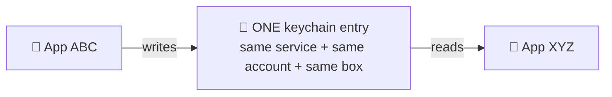
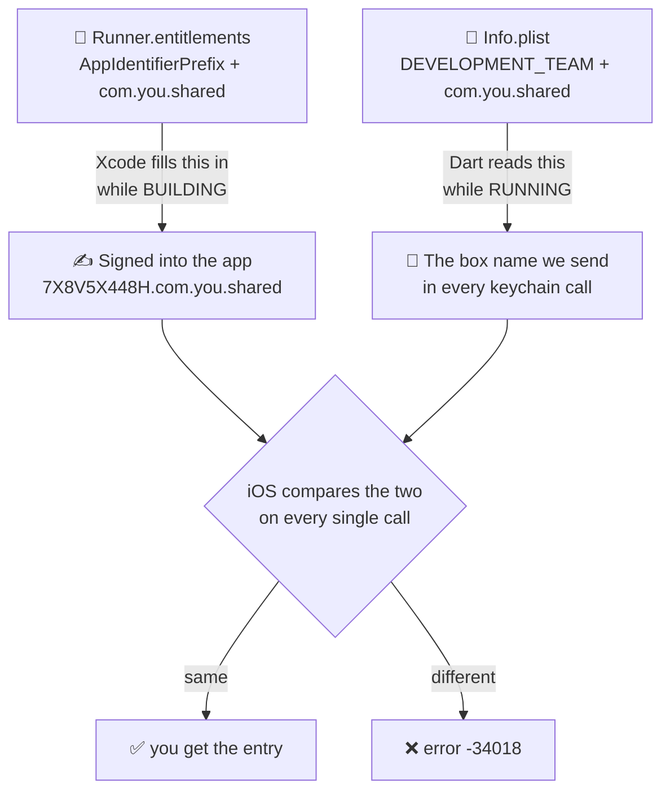
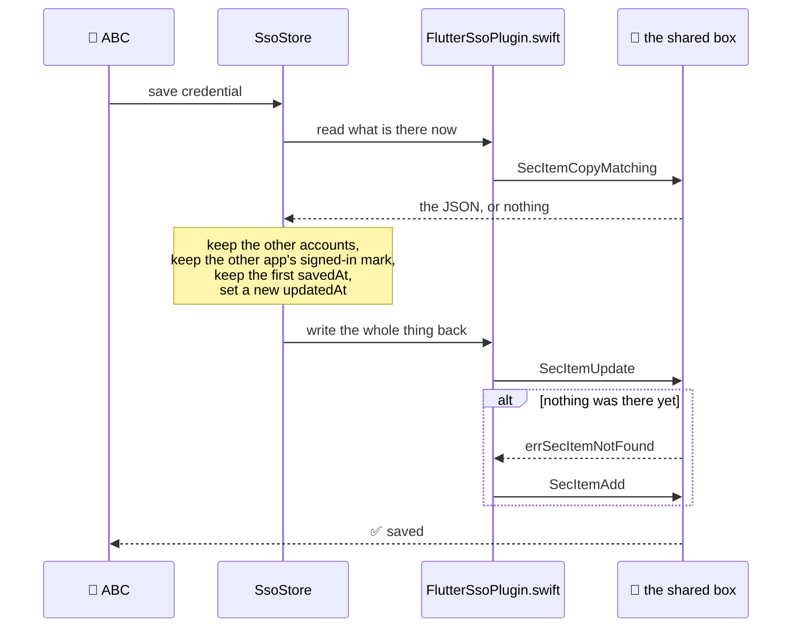
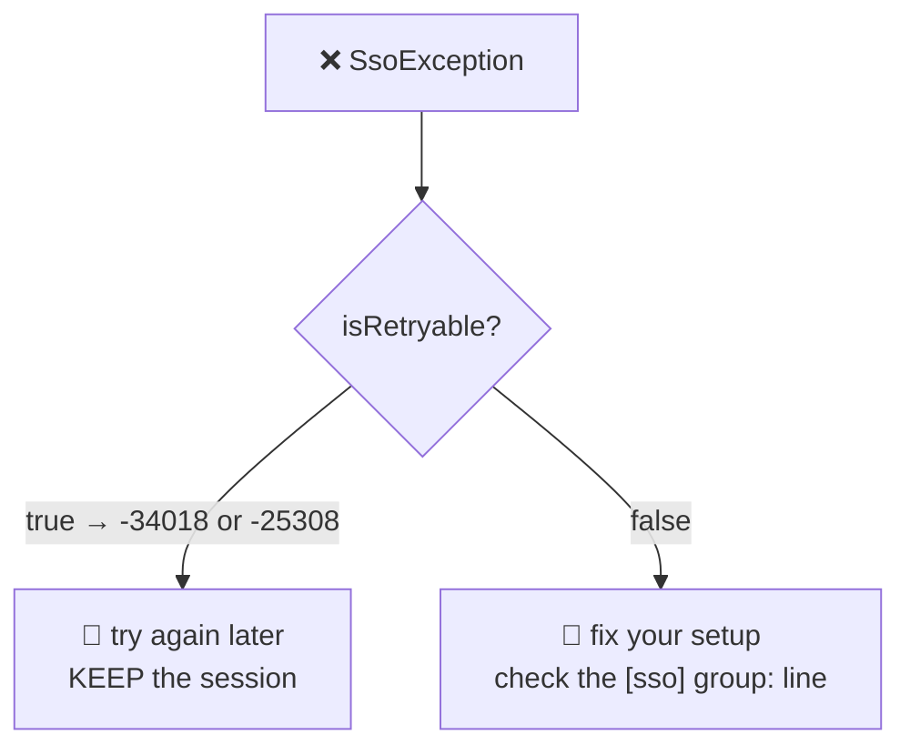
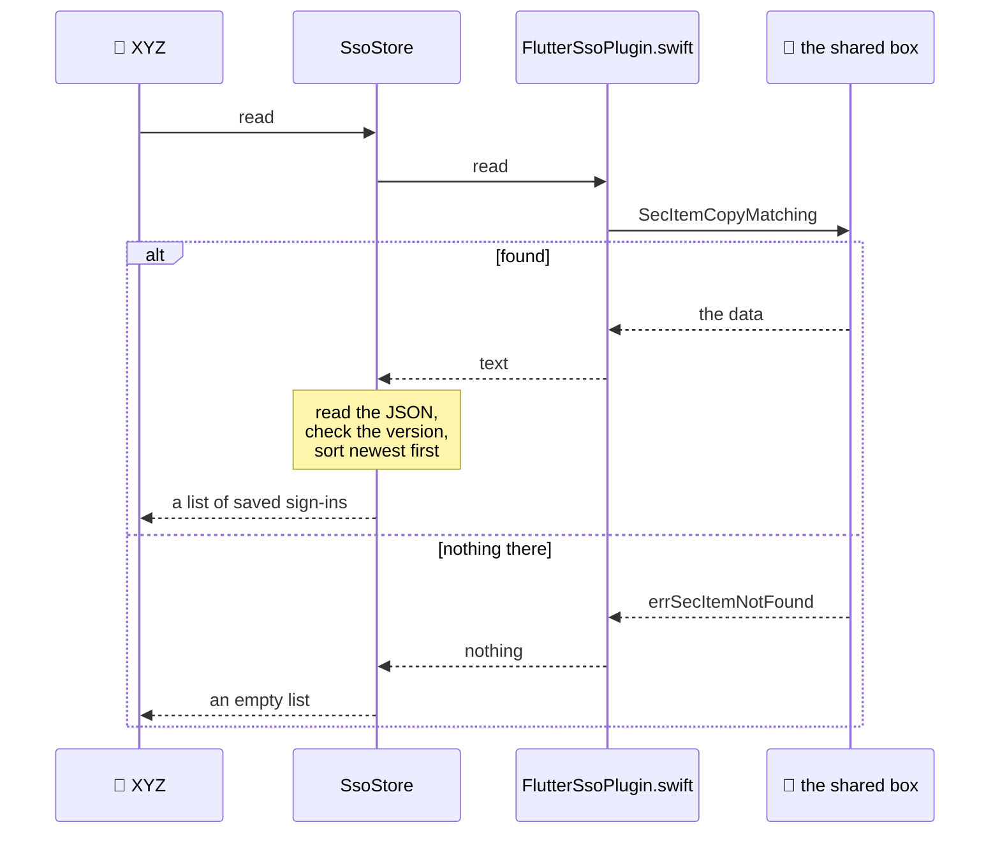
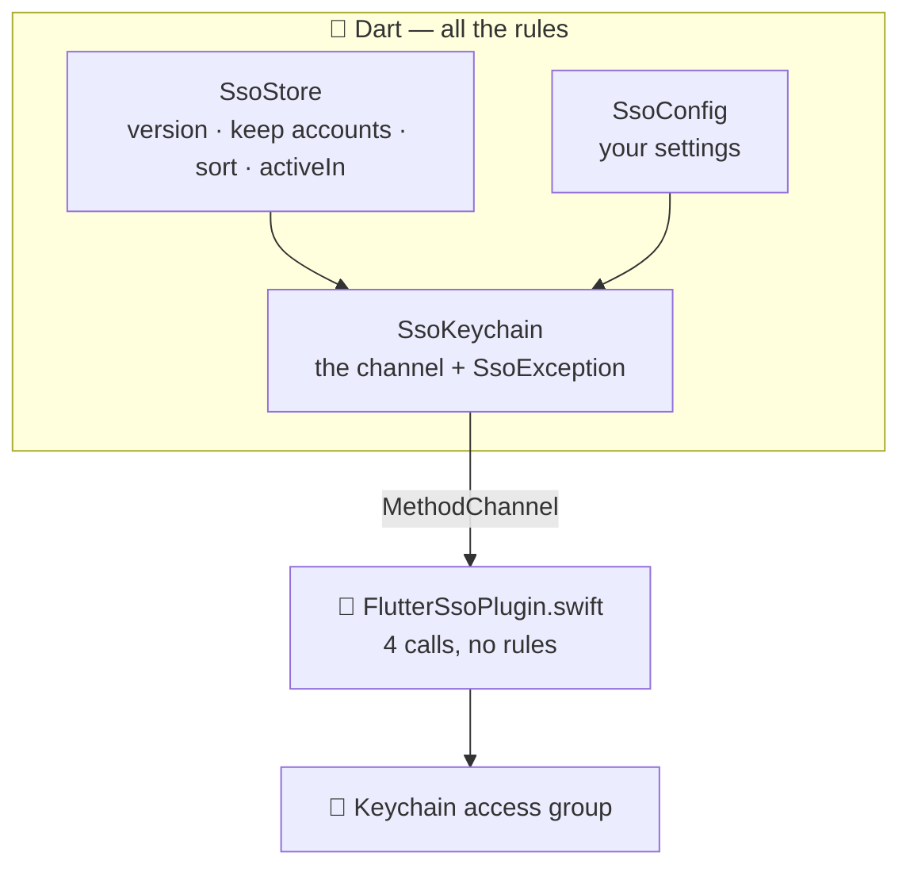

# 🍏 How flutter_sso works on iOS

**One locked box. Two apps. Apple does the checking.**

This file explains what happens inside. For setup and the API, see
[`README.md`](README.md). For the Android side, see
[`ANDROID_MECHANISM.md`](ANDROID_MECHANISM.md).

Every part below is written the same way: **the problem first**, then **what we do**, then
**which Apple concept we used**.

---

## 📑 What is in this file

- [The big picture](#-the-big-picture)
- [Concepts we use from iOS](#-concepts-we-use-from-ios)
- [Problem 1: apps cannot read each other's files](#-problem-1-apps-cannot-read-each-others-files)
- [Problem 2: how do we stop other companies getting in?](#-problem-2-how-do-we-stop-other-companies-getting-in)
- [Problem 3: the box name is not readable while the app runs](#-problem-3-the-box-name-is-not-readable-while-the-app-runs)
- [Problem 4: how do both apps find the same entry?](#-problem-4-how-do-both-apps-find-the-same-entry)
- [Problem 5: saving without wiping the other app's work](#-problem-5-saving-without-wiping-the-other-apps-work)
- [Problem 6: there is no "save or update" call](#-problem-6-there-is-no-save-or-update-call)
- [Problem 7: a locked phone](#-problem-7-a-locked-phone)
- [Problem 8: the sign-in must not follow the user to another device](#-problem-8-the-sign-in-must-not-follow-the-user-to-another-device)
- [Problem 9: deleting could take your other app's data](#-problem-9-deleting-could-take-your-other-apps-data)
- [Problem 10: a real error and a bad moment look the same](#-problem-10-a-real-error-and-a-bad-moment-look-the-same)
- [Problem 11: a slow read on the launch screen](#-problem-11-a-slow-read-on-the-launch-screen)
- [Why the Android-only methods do nothing here](#-why-the-android-only-methods-do-nothing-here)
- [What happens when an app is deleted](#-what-happens-when-an-app-is-deleted)
- [The whole thing on one page](#-the-whole-thing-on-one-page)

---

## 🎯 The big picture

Both apps read and write **the same single keychain entry**, inside a locked box that Apple
signed into both of them.

On iOS, **sharing is the storage**. There is no message between the apps. No searching. No
handshake. App A writes. App B reads the same thing.



That is the whole difference from Android, where no shared box exists and the apps have to
ask each other.

---

## 🧠 Concepts we use from iOS

| Apple concept | In plain words | What we use it for |
| --- | --- | --- |
| **Keychain** | Apple's built-in encrypted store for small secrets | The place the sign-in lives |
| **Keychain access group** | A part of the keychain that more than one of your apps may open | This **is** the sharing |
| **Entitlements** | A list of things Apple allows your app to do, signed into the app itself | Proof that your app may open that box |
| **Team ID** (`AppIdentifierPrefix`) | The id of your Apple developer account | Apple only signs box names that start with **your** Team ID |
| **Generic password item** | The simplest kind of keychain entry | Our one saved record |
| **`SecItemCopyMatching`** | Read from the keychain | `read()` |
| **`SecItemUpdate`** | Change an entry that exists | `save()` |
| **`SecItemAdd`** | Create a new entry | `save()`, first time only |
| **`SecItemDelete`** | Remove an entry | `clear()` |
| **`kSecAttrAccessible`** | Rule for when an entry may be read | Lets us read while the screen is locked |
| **`kSecAttrSynchronizable`** | Should this follow the user's iCloud account? | We say **no** |
| **`Info.plist`** | A settings file the app can read while running | How Dart learns the box name |
| **`OSStatus`** | Apple's error numbers | Tells "try again" apart from "you set it up wrong" |
| **`MethodChannel`** | Flutter's bridge from Dart to native code | All four calls go through one |

---

## 🚧 Problem 1: apps cannot read each other's files

**❓ The problem**

A phone keeps apps apart on purpose. Your app cannot open another app's files. That rule is
good — it stops a bad app stealing your data. But it also stops **your own** two apps from
sharing a sign-in.

**✅ What we do**

We do not use files. We use the **keychain**, and we ask Apple for a part of it that both
apps may open. Apple calls that a **keychain access group**.

Think of the keychain as a building full of locked boxes. Normally your app gets its own
box. If you ask for it, Apple gives two of your apps a key to **one shared box**.

**🧩 Concept used:** Keychain, keychain access group.

---

## 🔐 Problem 2: how do we stop other companies getting in?

**❓ The problem**

If a shared box is just a name, what stops some other company writing the same name in
their app and reading your users' sign-ins?

**✅ What we do**

Nothing — because **we do not have to**. Apple checks it for us.

The box name must start with your **Team ID**, which is the id of your Apple developer
account. And Apple will only sign a box name that starts with **your own** Team ID. Another
company cannot get that signature, so their app can never open your box. It does not matter
what they type in their code.

So the box is two things at once:

1. 📦 the place the sign-in lives, and
2. 🛡 the proof that only your apps can reach it.

> 🔑 On iOS, "same developer" means exactly one thing: **same Apple Team ID.**

This is also why the package never looks for your other app. **It cannot, and it does not
try.** There is nothing to look for. Both apps just open the same box.

**🧩 Concept used:** Entitlements, Team ID / `AppIdentifierPrefix`.

---

## 📄 Problem 3: the box name is not readable while the app runs

**❓ The problem**

The box name in your entitlements file looks like this:

```
$(AppIdentifierPrefix)com.yourcompany.shared
```

`$(AppIdentifierPrefix)` is a **build-time** thing. Xcode swaps it for your real Team ID
while it builds the app. Once the app is running, that word is gone — and **Dart has no way
to find out what it became**.

But Dart is the side that has to put the box name in every keychain call. So Dart needs the
finished name.

**✅ What we do**

We write the same name a **second time**, in `Info.plist`, which the app **can** read while
it is running. Xcode fills in `$(DEVELOPMENT_TEAM)` there. Dart then reads that one small
string through the channel and uses it.

That is the whole reason iOS setup asks you for the same value twice. It is not
duplication for the sake of it.



**And we refuse a half-filled value** rather than sending it on:

```swift
guard let value = Bundle.main.object(forInfoDictionaryKey: key) as? String,
  !value.isEmpty,
  // An unresolved build variable means the Info.plist wiring is wrong.
  !value.contains("$(")
else { return nil }
```

If Xcode did not fill it in, the text still has `$(` in it. We treat that as **missing**, and
Dart throws `SsoException('misconfigured', …)`. So a broken setup **complains at once**,
instead of quietly returning "no accounts" for the rest of time.

The finished name is worked out once per app run, logged, and kept:

```
[sso] group: 7X8V5X448H.com.yourcompany.shared
```

> 🔎 **Always check this line first.** If it is not the full, finished name — Team ID and
> all — then nothing else can possibly work.

**🧩 Concept used:** `Info.plist`, build settings, `MethodChannel`.

---

## 🧭 Problem 4: how do both apps find the same entry?

**❓ The problem**

The keychain has no folders and no file names. You do not open an entry by path. You
describe it, and the keychain finds the one that matches. So both apps must describe it in
**exactly** the same way — or each app quietly gets its own separate entry and nothing is
ever shared.

**✅ What we do**

We always send the same four things. All four must be **exactly the same** in every app:

| What we send | Value | Where it comes from |
| --- | --- | --- |
| Kind of entry | generic password | fixed in the code |
| Service | `flutter_sso` | `SsoConfig.keychainService` |
| Account | `sso_credentials` | `SsoConfig.recordKey` |
| Box | `7X8V5X448H.com.you.shared` | `Info.plist` |

Same four values → same one entry. App ABC writes it. App XYZ reads it. Neither knows the
other exists.

What we put inside is one piece of text: JSON, with a version number on it.

```json
{ "v": 2, "credentials": [ { "userId": "u_1", "seed": "…", "proof": "…", "activeIn": ["abc"] } ] }
```

Nothing about your company is written into the Swift code. The service name and the box name
are **always** passed in from Dart.

**🧩 Concept used:** Generic password item, keychain search attributes.

---

## 💾 Problem 5: saving without wiping the other app's work

**❓ The problem**

There is only **one** entry, and a write replaces **all** of it. Two things could go wrong:

- Two people share the phone. If a save only kept one account, the second person to sign in
  would silently wipe the first.
- Your other app has already marked itself as signed in. A careless save would erase that
  mark, and your other app would think it was signed out.

**✅ What we do**

A save **reads first**, then writes the whole thing back with everything kept:



All of that care lives in `SsoStore` in Dart, **not** in the Swift. The Swift only moves
text in and out.

**🧩 Concept used:** `SecItemCopyMatching`, `SecItemUpdate`, `SecItemAdd`.

---

## 🔁 Problem 6: there is no "save or update" call

**❓ The problem**

Apple gives you two separate functions, and each one fails in the case the other handles:

- `SecItemAdd` fails with `errSecDuplicateItem` if the entry already exists.
- `SecItemUpdate` fails with `errSecItemNotFound` if it does not.

There is no single "save it either way" call.

**✅ What we do**

Try update first. If it says "not found", then add:

```swift
let updateStatus = SecItemUpdate(query, [kSecValueData: data])
if updateStatus == errSecSuccess { return result(nil) }
guard updateStatus == errSecItemNotFound else { … }

var insert = query
insert[kSecValueData] = data
SecItemAdd(insert, nil)
```

Update goes first because the normal case is "the entry already exists". So the normal case
costs **one** call, and only the very first save on a phone ever costs two.

> ⚠️ **Every call names the box. Always.** This matters more than it looks. Once your app
> has a `keychain-access-groups` entitlement, that box becomes the **default** for any write
> that does not name one. So a write that forgot to name the box would quietly move the
> entry into the shared box. Our Swift has **no code path** that builds a call without the
> box name.

**🧩 Concept used:** `SecItemAdd`, `SecItemUpdate`, `OSStatus` codes.

---

## 🔒 Problem 7: a locked phone

**❓ The problem**

The keychain lets you choose when an entry may be read. If you pick the strictest setting,
the entry can only be read while the phone is unlocked. That sounds safer — but then a
background refresh, or anything that runs while the screen is off, **can never read the
sign-in**. Your app breaks in a way that is very hard to find.

**✅ What we do**

We use `kSecAttrAccessibleAfterFirstUnlockThisDeviceOnly`. Two parts:

- **`AfterFirstUnlock`** — readable while the screen is locked, as long as the user has
  unlocked the phone **once** since it was switched on. So nothing in the background gets
  stuck.
- **`ThisDeviceOnly`** — never leaves this phone, and never goes into an iCloud or iTunes
  backup.

If you want Face ID in front of the sign-in, put it in front of **your screen** — not on the
entry. Otherwise background work can never get in.

> 🐛 **A nasty trap.** This setting is also used as a **filter when reading**. If your two
> apps disagree about it, every read finds nothing — while all the other values look
> perfectly right, and **no error is raised**. That is why we fix it in code instead of
> making it a setting.

**🧩 Concept used:** `kSecAttrAccessible`.

---

## ☁️ Problem 8: the sign-in must not follow the user to another device

**❓ The problem**

The keychain can sync entries through iCloud. That is right for passwords. It is **wrong**
here.

A saved sign-in describes **this phone**: which of your apps hold a session, and what this
phone's device secret is. Copy it to an iPad and every one of those statements becomes
false.

**✅ What we do**

```swift
// Never sync: a record that follows the iCloud account to another device
// stops describing this device. Also, group + synchronizable is fatal.
kSecAttrSynchronizable as String: false,
```

We turn syncing off. There is a second reason too: a shared box **plus** syncing is a
combination Apple does not support, and it fails in confusing ways.

**🧩 Concept used:** `kSecAttrSynchronizable`.

---

## 🚫 Problem 9: deleting could take your other app's data

**❓ The problem**

A shared box may hold **other** entries. Your other app might keep its own things in there
for its own reasons. A "delete everything in the box" call would take all of them — and your
other app would break, for no reason it could see.

**✅ What we do**

We only ever delete **the one entry this package owns**, named by its service and account:

```swift
// By key only. There is deliberately no deleteAll: in a shared access group
// a blanket delete takes the sibling app's items with it.
let status = SecItemDelete(args.query as CFDictionary)
```

There is **no** "delete all" in this package. And "it was already gone" counts as success,
because that is the result the caller wanted anyway.

**🧩 Concept used:** `SecItemDelete`.

---

## 💥 Problem 10: a real error and a bad moment look the same

**❓ The problem**

Some keychain failures mean **you set it up wrong**. Others mean **you asked at a bad
moment** and it will work fine in a second.

If your app cannot tell them apart, it does the worst thing: it treats a bad moment as "this
user is signed out" and throws away their session.

**✅ What we do**

We pass Apple's error number straight through to Dart as the error code, so the two
"bad moment" cases stay easy to spot:

```swift
private static func error(_ status: OSStatus, _ operation: String) -> FlutterError {
  let message = SecCopyErrorMessageString(status, nil) as String? ?? "keychain error"
  return FlutterError(code: "\(status)", message: "\(operation): \(message)", details: nil)
}
```

| Number | Apple's name | What it really is | Try again? |
| --- | --- | --- | --- |
| `-34018` | `errSecMissingEntitlement` | Wrong or missing box name, a half-filled build value — **or** a known iOS hiccup at launch | ✅ yes |
| `-25308` | `errSecInteractionNotAllowed` | Phone was locked, or has not been unlocked since it started | ✅ yes |
| anything else | | A real setup mistake | ❌ no |

> 🔑 **How to tell them apart yourself:** a setup mistake happens **every single time**.
> These two come and go. That is the whole idea behind `isRetryable` — and why `true` must
> never make your app sign the user out.



There is one more place we hide a difference on purpose. A read that finds nothing and a read
with a **wrong box name** both come back as "nothing":

```swift
case errSecItemNotFound:
  // Genuinely empty, or the group name is wrong. Indistinguishable here on
  // purpose — Dart treats both as "no saved accounts".
  result(nil)
```

Why hide it? Because your app should do the **same thing** in both cases: show the normal
sign-in screen. Telling them apart would only tempt someone into showing the user an error
about something the user cannot fix.

**🧩 Concept used:** `OSStatus`, `SecCopyErrorMessageString`.

---

## ⏱ Problem 11: a slow read on the launch screen

**❓ The problem**

`read()` runs while your app is starting — the moment the user is actually looking at the
screen. If the keychain is slow for any reason, your launch screen sits there.

**✅ What we do**

We put a time limit on it: `SsoConfig.readTimeout`, **400 ms** on iOS. If it takes longer, we
give up and return an empty list, and the user sees the normal sign-in screen.

400 ms is plenty for one keychain read. The limit is there for the rare bad case, not the
normal one.



**🧩 Concept used:** Dart `Future.timeout` around the `MethodChannel` call.

---

## 🕳 Why the Android-only methods do nothing here

`SsoKeychain` has six extra methods for Android: `readInbox`, `pushToPeers`, `pullPeers`,
`removeLocalCopies`, `removePeers` and `clearPeers`. On iOS each one returns straight away:

```dart
Future<List<String>> readInbox() async {
  if (!Platform.isAndroid) return const [];
  …
}
```

**❓ Why they exist at all:** on Android every app keeps its **own** copy of the data, so
copies have to be sent around, collected, and removed together.

**✅ Why iOS needs none of it:** here your other app writes **the very entry `read()`
returns**. There is no second copy. Nothing to collect. Nothing to keep in step. `SsoStore`
calls these methods anyway, and on iOS they simply do nothing.

The same reason explains this line:

```dart
if (Platform.isIOS) 'accessGroup': await accessGroup(),
```

On iOS the box **is** the sharing, so we always name it. Android has no box to name — there,
the certificate check does that job instead.

---

## 🗑 What happens when an app is deleted

**A keychain entry lives on after the app that wrote it is deleted.**

Delete app ABC, and app XYZ keeps working with the sign-in ABC saved. iOS does this for you.
Nothing in the package is needed.

This is the one place iOS is simpler than Android, where the door disappears with the app and
the package has to keep a copy to soften the loss.

> 🧹 Because the entry survives, it also survives a **reinstall**. An app deleted and put
> back finds the sign-in already there. If you want deleting the app to forget the account,
> give the user a "remove saved sign-ins" button and call `clear()` — iOS gives you no way to
> run code when your app is deleted.

---

## 🗺 The whole thing on one page

Four calls over one `MethodChannel` named `flutter_sso/keychain`. That is all the iOS side
is.

| Call | What the Swift does | What it needs |
| --- | --- | --- |
| `infoValue` | Reads one `Info.plist` value, refusing anything still holding `$(` | `key` |
| `read` | `SecItemCopyMatching` | `key`, `service`, `accessGroup` |
| `write` | `SecItemUpdate`, then `SecItemAdd` if needed | the same, plus `value` |
| `delete` | `SecItemDelete` | `key`, `service`, `accessGroup` |

157 lines of Swift. No state of its own. Nothing about any company written into it.

**Every rule about what the saved data *means*** — the version number, keeping other
accounts, sorting, which app is signed in — **lives in Dart**. That way there is exactly one
copy of those rules, instead of two that slowly drift apart.



---

**See also:** [`README.md`](README.md) · [`ANDROID_MECHANISM.md`](ANDROID_MECHANISM.md)
